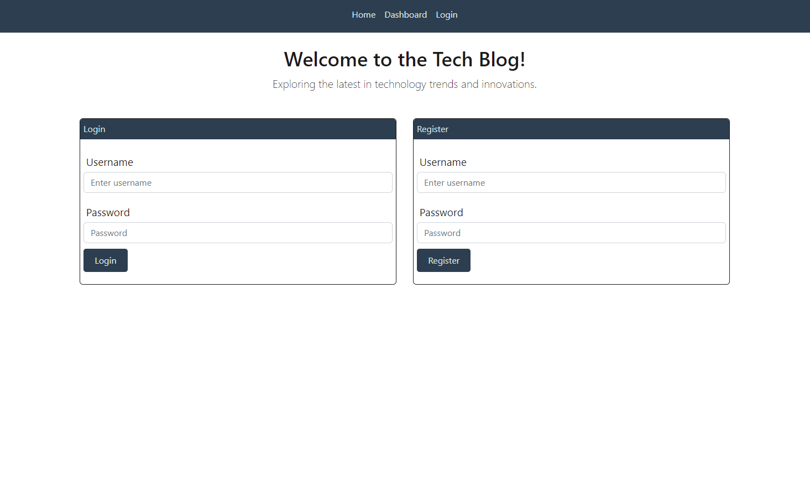

# CMS-Tech-Blog

<div align="center">
  
</div>

## Table of Contents

- [Description](#description)
- [Installation](#installation)
- [Deployed Application](#deployed-application)
- [License](#license)
- [Contributing](#contributing)
- [Tests](#tests)
- [Questions](#questions)

## Description

The CMS-Style Blog Site is a dynamic web application that provides users with a platform to create, edit, and manage their own blog posts. It offers a seamless user experience with intuitive navigation and authentication features.

### Key Features:

- **Homepage Display:** Upon visiting the site, users are presented with the homepage containing existing blog posts (if any have been posted), along with navigation links for the homepage and dashboard. Users also have the option to log in.
- **User Authentication:** Users can sign up by creating a unique username and password. Once signed up, their credentials are securely saved, allowing them to log in at any time.
- **Dashboard Functionality:** The dashboard provides users with an overview of their existing blog posts. They can create new posts, view, edit, or delete their existing posts.
- **Detailed Blog Post View:** Clicking on an existing blog post provides users with a detailed view, including the post title, content, creator's username, and date of creation. Users can also leave comments on the post.
- **Commenting System:** Users can interact with posts by leaving comments. When a comment is submitted, it is saved and the post is updated to display the comment along with the creator's username and creation date.
- **Idle Timeout:** If a user remains idle on the site for an extended period, they can still view posts and comments, but they will be prompted to log in again before being able to add, update, or delete posts.
- **Deployment:** You can access the deployed application on Heroku via *https://thawing-ridge-20238-f4b31f8a8c44.herokuapp.com/*.

Follow the installation instructions below to get started with the Tech Blog Application.

## Installation on local machine

### Clone the repository to your local machine

```sh
git clone https://github.com/dmerk2/CMS-Tech-Blog.git
```

### Create an environment variable file (.env) in the root directory of the project and add the following information:

```
DB_NAME="tech_blog_db"
DB_USER="<your_mysql_username>"
DB_PASSWORD="<your_mysql_password>"
```

### Direct to db folder to log into mysql shell and enter password

```sh
mysql -u root -p
```

### Add the schema to create the database structure

```sh
SOURCE schema.sql
```

### Install necessary dependencies and add the seeds to populate the database

```sh
npm i && npm run seeds
```

### Start the server

```sh
node server.js
```

Open your web browser and go to **http://localhost:3001** to access the Tech Blog

## Deployed Application

Click the lightning bolt [⚡](https://thawing-ridge-20238-f4b31f8a8c44.herokuapp.com/) to go to the tech blog on Heroku!

Homepage:


Login/Signup Page:



## License

This project is licensed under the terms of the **[MIT License](https://opensource.org/licenses/MIT)**

## Contributing

Daniel Merkin

## Tests

N/A

## Questions

If you have any questions or suggestions about this project, please feel free to contact me:

- GitHub: [@dmerk2](https://github.com/dmerk2)
- Email: dan.merkin@gmail.com
